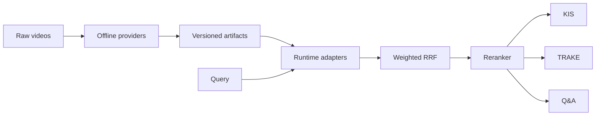

# Architecture

## Offline and online boundary

Heavy video processing occurs once. Query-time code loads immutable catalogs
and indexes. Batch 2 builders must emit the same canonical contract as Batch 1.

## Shared retrieval core

All channels return `RetrievalHit(frame_uid, score, rank, channel)`. Fusion
joins only on `frame_uid`, attaches evidence, and applies weighted reciprocal
rank fusion. Missing channels are absent from the sum.

KIS directly returns the ranked candidates. TRAKE retrieves candidates per
ordered event and applies strict temporal alignment. Q&A selects diverse
evidence and either invokes a configured VLM or returns an evidence-only human
review response.

## Replaceable providers

Protocols isolate:

- multimodal encoders;
- dense and lexical indexes;
- object detectors and ASR transcribers;
- rerankers;
- Q&A answer providers.

Provider/model choice is configuration, not task orchestration logic.

The initial shot-text fallback uses an in-memory lexical index and therefore
scans its document scores per query. It is acceptable for the runnable profile,
but must be promoted to a persisted `bm25s` artifact before large-corpus latency
is considered production-ready.
