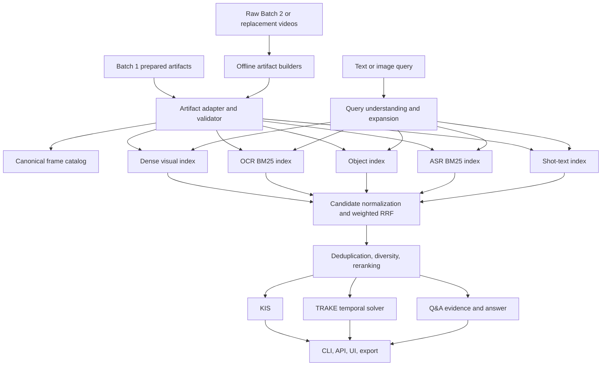

# HCMAIC Retrieval — Full Runnable-First Implementation Plan

Status: **APPROVED — source of truth for implementation**  
Scope: **KIS + TRAKE + Q&A**  
Strategy: **artifact-first, runnable-first, replaceable providers, fail closed**

## 1. Objective

Build a clean repository that runs the complete HCMAIC retrieval flow end to end:

1. Import and validate the teammate's Batch 1 retrieval artifacts.
2. Search by text or image and map every result back to the original video frame.
3. Fuse visual, OCR, object, ASR, and shot-text evidence.
4. Solve KIS, TRAKE, and Q&A through shared retrieval components.
5. Expose CLI and FastAPI entry points suitable for a lightweight web UI.
6. Preserve a stable artifact contract so Batch 2 can be processed without changing task code.
7. Make every model replaceable through configuration so stronger models can be benchmarked later.

The first release must be runnable and honest. It may use practical near-state-of-the-art defaults, but it must not claim HCMAIC quality without qrels and must never fabricate scores for missing channels.

## 2. Inputs and reuse boundaries

### 2.1 Teammate Kaggle Batch 1 artifacts

Expected dataset profile: `batch1-kaggle-v5`.

| Artifact | Expected contract | Role |
|---|---:|---|
| `faiss_flat_ip.index` | `IndexFlatIP`, 233,062 rows, 1,152 dimensions | dense visual retrieval |
| `keyframe_meta.parquet` | 233,062 rows | canonical frame mapping and OCR evidence |
| `shot_text.parquet` | 76,418 rows | shot-level lexical evidence |
| `bm25/` | 220,649 documents | OCR lexical retrieval |
| raw video folders | 873 videos | playback and source-of-truth verification |

Batch 1 uses `google/siglip2-so400m-patch16-384`. Query-time image and text encoders must use the exact compatible checkpoint and preprocessing revision.

### 2.2 Selected code concepts from existing repositories

Reuse by extraction and adaptation, not by copying entire repositories:

- FastAPI request/response patterns and timeline UI from `wintermouse05/aic-26`.
- Strict-monotonic temporal dynamic programming from the existing TRAKE prototype.
- Artifact manifests, provider interfaces, RRF, deduplication, reranker contracts, submission validation, and fail-closed behavior from the SkillPixel pipeline.

Do not reuse:

- generated data, model weights, indexes, caches, credentials, or private tokens;
- NumPy-only retrieval when the canonical Batch 1 FAISS artifact is available;
- mock score generation in a production execution path;
- any identity contract that confuses FAISS rows with source frame IDs.

## 3. System architecture



## 4. Canonical identity and data contract

Every channel must map its evidence to one canonical frame record.

| Canonical field | Batch 1 source | Meaning |
|---|---|---|
| `dense_row` | `faiss_id` | row in one dense index; internal only |
| `feature_row` | provider-specific | row in a source feature matrix; internal only |
| `frame_uid` | generated | globally stable `{video_id}:{source_frame_idx}` |
| `video_id` | `video_id` | official video identity |
| `group` | `group` | source folder/group identity |
| `keyframe_id` | `n` | keyframe ordinal in the supplied artifact |
| `source_frame_idx` | `frame_idx` | zero-based frame in the original video |
| `timestamp_ms` | `round(pts_time * 1000)` | seek position in the source video |
| `shot_id` | `shot_id` | shot identity |

Required invariant:

```text
metadata.iloc[i].faiss_id == i
```

`dense_row`, `feature_row`, and `keyframe_id` are never valid submission frame numbers. Only `source_frame_idx` is exported as the source-frame identity.

### 4.1 Frame record

```json
{
  "frame_uid": "L21_V001:12345",
  "video_id": "L21_V001",
  "group": "Videos_L21_a",
  "keyframe_id": 81,
  "source_frame_idx": 12345,
  "timestamp_ms": 411833,
  "shot_id": 42,
  "dense_row": 1234,
  "image_path": "keyframes/L21_V001/000081.jpg",
  "video_path": "Videos_L21_a/video/L21_V001.mp4",
  "ocr_text": "...",
  "artifact_version": "batch1-kaggle-v5"
}
```

### 4.2 Candidate and evidence

One candidate is keyed by `frame_uid` and may contain several evidence records:

```text
visual score + OCR rank + object rank + ASR rank + shot-text rank
    -> one canonical frame candidate
```

Each evidence record contains channel, raw score, channel rank, text or labels, model version, artifact version, and provenance level.

## 5. Artifact lifecycle

Artifacts remain outside Git and are referenced by configuration.

```text
artifacts/<dataset-version>/
  manifest.json
  catalog/keyframe_meta.parquet
  dense/faiss_flat_ip.index
  lexical/ocr_bm25/
  lexical/shot_bm25/
  objects/objects.parquet
  lexical/object_bm25/
  asr/segments.parquet
  lexical/asr_bm25/
```

The manifest records:

- dataset version and source URI;
- file size and SHA-256 where practical;
- row counts and dimensions;
- model ID, revision, preprocessing and normalization;
- build timestamp and code SHA;
- provider/device/dtype;
- parent artifact versions;
- completion and validation status.

No downstream index is promoted if its parent catalog hash differs.

## 6. Runnable v1 model profile

These are practical defaults, not permanent winners.

| Phase | Runnable v1 default | Upgrade candidate |
|---|---|---|
| visual embedding | existing SigLIP2 So400m 384 artifact | benchmark Qwen3-VL Embedding/Jina or larger SigLIP2 only with qrels |
| visual search | exact FAISS `IndexFlatIP` | IVF/HNSW only when measured latency requires it |
| OCR | existing PP-OCRv5 detection + VietOCR text | PP-OCRv6 or paired hard-frame OCR benchmark |
| OCR retrieval | `bm25s` | calibrated lexical+dense shot-text hybrid |
| closed-set object | YOLO11m | larger YOLO profile when throughput allows |
| open-vocabulary object | optional Grounding DINO | benchmark only on object-heavy qrels |
| ASR | Faster-Whisper `large-v3-turbo` | Qwen3-ASR 0.6B/1.7B benchmark |
| fusion | weighted reciprocal rank fusion | learned fusion after sufficient labels |
| text reranker | BGE reranker v2 multilingual profile | benchmark newer multilingual rerankers |
| visual reranker/Q&A | Qwen3-VL-2B-Instruct | 4B/8B profile when hardware and qrels justify it |
| TRAKE sequence | strict monotonic dynamic programming | learned transition scoring after qrels |

Every provider must declare availability and fail closed. An unavailable optional provider removes its channel from fusion and is reported in the response; it never receives a fabricated neutral or positive score.

## 7. Query pipeline shared by all tasks

1. Validate query identity and input type.
2. Normalize whitespace and Unicode while preserving raw text.
3. Detect query intents: visual, OCR, object, speech, temporal, and answer-seeking.
4. Produce configured Vietnamese/English query variants without discarding the original.
5. Execute available retrieval channels in batches.
6. Convert all results to canonical `frame_uid` candidates.
7. Fuse channel ranks with weighted RRF.
8. Deduplicate exact and near-temporal frames.
9. Apply per-video and temporal diversity.
10. Rerank a bounded candidate set.
11. Route to KIS, TRAKE, or Q&A result assembly.

Weighted RRF:

$$
\operatorname{RRF}(c)=\sum_{j=1}^{m}\frac{w_j}{k+r_j(c)}
$$

where absent candidates contribute nothing, not rank infinity with a fake score.

## 8. KIS task

### 8.1 TKIS

```text
text query
  -> compatible SigLIP2 text embedding
  -> dense top-N
  -> OCR/object/ASR/shot lexical top-N
  -> fusion, dedup, diversity, rerank
  -> top-100 canonical frames
```

### 8.2 VKIS

```text
image query
  -> compatible SigLIP2 image embedding
  -> dense top-N
  -> optional query-image OCR/object cues
  -> fusion, dedup, diversity, rerank
  -> top-100 canonical frames
```

Every result includes video ID, source frame index, timestamp, channel scores, evidence, artifact versions, thumbnail path, and video seek information.

## 9. TRAKE task

TRAKE reuses the KIS retrievers.

1. Decompose the request into ordered events.
2. Retrieve candidates independently for each event.
3. Group candidates by `video_id`.
4. Reject transitions whose source frame is not strictly increasing.
5. Score semantic evidence plus plausible temporal gaps.
6. Use dynamic programming or bounded beam search to return top sequences.

For path `pi = (c1, ..., cT)`:

$$
S(\pi)=\sum_{t=1}^{T}s_t(c_t)+\lambda\sum_{t=2}^{T}g(c_{t-1},c_t)
$$

subject to:

$$
\operatorname{video}(c_1)=\cdots=\operatorname{video}(c_T)
$$

$$
\operatorname{frame}(c_1)<\cdots<\operatorname{frame}(c_T)
$$

V1 uses deterministic sentence/clause decomposition and supports an optional LLM decomposer through the same interface.

## 10. Q&A task

Q&A is retrieval-grounded:

1. Retrieve visual, OCR, ASR, and shot evidence.
2. Group evidence by video and shot.
3. Select a bounded, diverse evidence set.
4. Pass images plus OCR/ASR context to the configured VLM.
5. Return answer, confidence, and exact evidence frames.

If the VLM is unavailable or evidence is insufficient, return the evidence and `needs_human_review=true`. Do not generate an unsupported answer.

## 11. Repository layout

```text
HCMAIC-Retrieval/
  README.md
  LICENSE
  pyproject.toml
  .gitignore
  configs/
    batch1_kaggle_v5.yaml
    local_cpu.yaml
    gpu_24gb.yaml
    competition.yaml
  docs/
    FULL_IMPLEMENTATION_PLAN.md
    ARCHITECTURE.md
    DATA_CONTRACT.md
    RUNBOOK.md
    MODEL_BENCHMARK_ROADMAP.md
    EVALUATION.md
    IMPLEMENTATION_REPORT.md
  src/hcmaic_retrieval/
    contracts/
    artifacts/
    providers/
    indexing/
    retrieval/
    fusion/
    reranking/
    tasks/
    service/
    cli/
  tests/
    unit/
    integration/
    e2e/
```

## 12. Public interfaces

### 12.1 CLI

```text
hcmaic validate-artifacts --config <profile>
hcmaic search-kis --config <profile> --query <text> --top-k 100
hcmaic search-trake --config <profile> --query <text>
hcmaic answer-qa --config <profile> --question <text>
hcmaic serve --config <profile>
hcmaic export --task <kis|trake|qa> --input <results> --output <csv>
```

### 12.2 API

```text
GET  /health
GET  /system/info
POST /v1/kis/search
POST /v1/trake/search
POST /v1/qa/answer
GET  /v1/frames/{frame_uid}
GET  /v1/videos/{video_id}/timeline
POST /v1/export
```

Responses expose provider and artifact versions and report disabled channels.

## 13. Milestones and gates

### M0 — Repository foundation

- clean independent Git repository;
- Python 3.11 package;
- typed configuration;
- CLI skeleton;
- pytest, coverage, Ruff, Mypy;
- architecture and data-contract documentation.

Gate: package installs, CLI help runs, quality tools pass.

### M1 — Batch 1 artifact import

- load metadata without row reordering;
- validate required columns, uniqueness, ranges, index dimension and row count;
- validate shot ranges and lexical artifact availability;
- produce canonical catalog and validation report.

Gate:

```text
index.d == 1152
index.ntotal == 233062
len(metadata) == 233062
metadata.iloc[i].faiss_id == i
mapping_error_count == 0
```

The validator supports fixture-sized profiles; production expected counts are profile configuration, not hard-coded business logic.

### M2 — Runnable KIS

- visual query provider;
- FAISS adapter;
- BM25 adapter;
- candidate conversion;
- weighted RRF;
- deduplication/diversity;
- optional reranking;
- TKIS/VKIS CLI, API, and export.

Gate: deterministic end-to-end fixture searches and valid top-K canonical mappings.

### M3 — Object and ASR channels

- resumable object and ASR builders;
- versioned artifact writers;
- object/ASR lexical indexes;
- channel health and provenance;
- no mock score paths.

Gate: interruption/resume tests, manifest/hash checks, and real-provider smoke profiles.

### M4 — TRAKE

- deterministic event decomposition;
- per-event candidate retrieval;
- strict temporal alignment;
- sequence scoring and export.

Gate: all frames in one returned path share a video and increase strictly in source-frame order.

### M5 — Q&A

- evidence selection and context assembly;
- pluggable VLM;
- evidence-only fallback;
- answer/evidence/confidence output.

Gate: every generated answer carries evidence; insufficient evidence produces review status instead of hallucinated output.

### M6 — Service and lightweight UI-ready delivery

- FastAPI endpoints;
- health and system metadata;
- frame/timeline access;
- integration tests;
- one-command local startup.

Gate: all three tasks execute through HTTP using the fixture profile.

### M7 — Evaluation and promotion

- qrels adapter;
- Recall@1/5/20/50/100 and MRR;
- TRAKE sequence metrics;
- Q&A evidence recall and answer score adapter;
- ablations, latency, memory and error slices;
- promotion report.

Until official or reviewed qrels exist:

```text
RUNNABLE=true
ARTIFACT_VALIDATED=true
QUALITY_STATUS=UNVALIDATED_ON_HCMAIC
```

## 14. TDD and verification policy

For each milestone:

1. Add contract/user-journey tests.
2. Run and capture the intended RED failure.
3. Commit the RED checkpoint.
4. Implement the smallest correct production path.
5. Run the same tests to GREEN.
6. Commit the GREEN checkpoint.
7. Refactor only while tests remain green.

Final gates:

- no skipped tests in core task paths;
- at least 80% line coverage for repository-owned source;
- Ruff clean;
- Mypy clean;
- deterministic smoke run;
- no secrets, data, weights, indexes, or generated outputs tracked by Git.

## 15. Benchmark and model promotion rules

A new model is promoted only when:

1. It runs through the same canonical adapter.
2. Dataset snapshot and preprocessing are recorded.
3. It beats the current profile on reviewed qrels or a clearly named slice.
4. Mapping correctness does not regress.
5. Latency, storage and memory remain acceptable for the intended hardware.
6. The previous provider remains selectable as rollback.

Exact FAISS search having full recall within an index does not prove semantic retrieval quality against ground truth.

## 16. Security and repository hygiene

- Read credentials from environment variables or user-local credential stores only.
- Never print tokens or include them in reports.
- Use safe Parquet/JSON/FAISS loading paths; do not load untrusted pickle files.
- Resolve media paths beneath configured roots before serving them.
- Restrict file upload type and size.
- Do not expose absolute host paths in public API responses.
- Keep generated artifacts outside the repository.

## 17. Definition of Done

The runnable-first repository is complete when:

- Batch 1 artifacts can be validated and loaded without copying them into Git.
- TKIS and VKIS return canonical source-frame results.
- OCR, object and ASR phases exist as real optional providers with explicit health.
- Fusion, deduplication, diversity and reranking execute through stable interfaces.
- TRAKE returns strictly ordered frames from one video.
- Q&A returns grounded evidence and either an answer or an explicit review fallback.
- CLI and FastAPI run all three tasks.
- Batch 2 can be built into the same artifact contract.
- Tests, coverage, Ruff, Mypy and smoke runs pass.
- Quality claims remain gated by qrels and benchmark evidence.

## 18. Implementation order

```text
M0 -> M1 -> M2 -> M4 -> M5 -> M6
                \
                 -> M3 can proceed independently
                \
                 -> M7 evaluates every promoted profile
```

This order produces useful KIS retrieval early while preserving the complete long-term KIS, TRAKE, and Q&A architecture.

## 19. Primary model references

- SigLIP2 paper: <https://arxiv.org/abs/2502.14786>
- SigLIP2 So400m checkpoint: <https://huggingface.co/google/siglip2-so400m-patch16-384>
- PaddleOCR: <https://github.com/PaddlePaddle/PaddleOCR>
- Faster-Whisper: <https://github.com/SYSTRAN/faster-whisper>
- Qwen3-ASR: <https://github.com/QwenLM/Qwen3-ASR>
- Qwen3-VL: <https://github.com/QwenLM/Qwen3-VL>
- Grounding DINO: <https://github.com/IDEA-Research/GroundingDINO>

